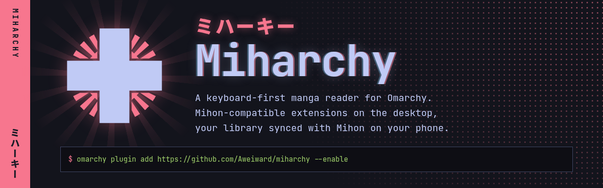

<a href="https://aweiward.github.io/miharchy/"></a>

# Miharchy

See it in action on [aweiward.github.io/miharchy](https://aweiward.github.io/miharchy/).

A manga reader that feels native on [Omarchy](https://omarchy.org). It runs [Mihon](https://github.com/mihonapp/mihon)-compatible extensions from the extension repos you add, through [Suwayomi-Server](https://github.com/Suwayomi/Suwayomi-Server), and it syncs your library with Mihon on your phone.

Miharchy is not affiliated with Mihon, Suwayomi or Omarchy. It provides no extensions or extension repos and hosts no content. Extension repos are third-party: add only ones you trust.

Status: [v1.0.0](https://github.com/Aweiward/miharchy/releases/tag/v1.0.0), at Mihon parity. See `GLOSSARY.md` and `docs/adr/`.

## Install

```sh
omarchy plugin add https://github.com/Aweiward/miharchy --enable
```

This clones the plugin into `~/.config/omarchy/plugins/miharchy` and puts the Miharchy mark in the bar. Middle click the mark to open the window. The first time, the window opens on Setup.

To update:

```sh
omarchy plugin update miharchy
omarchy-restart-shell
```

Run `omarchy-restart-shell` after every update. The shell reloads the plugin when its files change, but it reuses its cached copy of the plugin's code ([omacom/omarchy#6981](https://github.com/omacom/omarchy/issues/6981)), so the bar mark keeps running the old code until the shell restarts. A window that is open keeps running the old code: within half a minute its status bar shows "new version   Q restart". Press `Q` or click it. The window saves what the reader read, quits, and opens again on the new code.

## Setup

Setup lists the steps below. Move with `j` and `k`, press Enter on a step. A step that changes your system asks first: press `y` to run it, `n` to cancel. Setup never runs `sudo` out of sight: the one step that installs packages opens Omarchy's terminal on the exact command, and you type your password there. Every step checks its own state, so you can run Setup again at any time (`:` then Setup).

1. Packages: installs what a stock Omarchy lacks (a JDK 21+, `qt6-websockets`, `suwayomi-server-bin`) through `omarchy-pkg-add` and `omarchy-pkg-aur-add`, after `y`, in Omarchy's floating terminal. If the AUR's Suwayomi-Server is newer than the version Miharchy is checked with, it says so first.
2. Server: runs `server/miharchy-server`. It creates `~/.config/miharchy/server.json` with a random password and enables the `miharchy-server` user service on `127.0.0.1:4590`.
3. FlareSolverr (optional, needs Docker): starts the `miharchy-flaresolverr` container on `127.0.0.1:8191` for Cloudflare sources.
4. Sync folder: the folder Mihon and Miharchy exchange backups through.
5. Phone backups: done once a phone backup has landed in the sync folder. Until then it says what to do in Mihon, and checks again on its own while Setup is open. Without Syncthing, `y` installs and starts it in Omarchy's terminal. With Syncthing running, it pairs the phone: it shows this desktop's Syncthing ID as a QR code to scan in Syncthing-Fork, then `y` accepts the phone and the folder it shares, into the sync folder. Several offered folders, none named `autobackup`: accept the right one in Syncthing's page (http://127.0.0.1:8384). A sync folder that holds only a folder named `autobackup` is Mihon's storage folder: set the sync folder to that `autobackup` folder instead.
6. Sync helper: builds the sync helper into `~/.local/share/miharchy/helper`. The first build downloads Gradle and libraries and takes a few minutes. After `omarchy plugin update` the step shows "out of date" when the helper changed; build it again.
7. App launcher entry: writes `~/.local/share/applications/miharchy.desktop`, so Miharchy shows in the app launcher (Super + Space).
8. Peek key: adds `SUPER + M` (the peek key) and `SUPER + CTRL + M` (the next key) to `~/.config/hypr/bindings.lua`, once each. It adds only the one that is missing. If a key is taken, or the file is missing, Setup shows the line to add yourself with another key. A bind you moved to another key stays as it is.

## Peek

Press `SUPER + M` from any workspace. Miharchy opens over it as a peek, on the next chapter of the first manga in Up next. Up next lists your library manga in this order:

1. A manga whose next chapter you left half read.
2. A manga you started that has at most 5 unread chapters.
3. A manga with an unread update from the last 7 days.

Inside the first two groups, the manga you read last comes first; in the third, the newest update. Up next leaves out a manga whose source is not installed, and a manga you hid on History until it gets a new update. Each manga's chapter filters pick its next chapter.

Press `SUPER + M` again to hide it. Switching workspaces hides it too, and the next press brings it back on the same page.

Press `SUPER + CTRL + M` to show the peek on the next manga in Up next, at its next chapter. Each press moves one manga on, and after the last manga it starts again at the first. With the reader closed, the first press opens the second manga. The keys walk Up next in the order it had at your first press, so the manga you just read does not jump back to the front. If the reader shows a manga that is not in Up next, the key opens the first manga.

- The peek lives on its own Hyprland special workspace, `special:miharchy`, like Omarchy's scratchpad.
- If the window is already open on a normal workspace, the key focuses it there and resumes. It never moves a window you placed.
- With nothing left to read, the peek opens the Library with its search.
- From a terminal: `~/.config/omarchy/plugins/miharchy/window/miharchy peek`, or `peek-next` for the next manga.

The mark's popup lists the first 3 manga in Up next above the new chapters. Each row shows the next chapter and why the manga is there: the page you reached ("p. 4 / 20"), the chapters left ("3 left"), or the age of its newest update ("new 2d"). Press Enter or click a row to open that chapter in the peek. `SUPER + CTRL + M` then goes on from that manga.

**Catch-up.** A peek reads at most 3 chapters of one manga in a row. After the third, the reader stops on the chapter transition page, says "Caught up on 3 chapters" and names the next manga in Up next. Press `c` to go on with this manga anyway, or `n` to open the next manga, as `SUPER + CTRL + M` would. Every peek that opens a manga, `n`, `SUPER + CTRL + M` and the popup's Up next rows too, starts a new count. Change the number, or turn it off, with the Settings row "Catch-up". A chapter counts when you read on past its end, in Incognito mode too. A chapter you open from the Library, Updates, History or the popup's new chapters is a normal read and never stops.

## Reader

**Crop borders.** The reader hides the plain white or black margin around a page. The page file stays as it is: `S` saves it and `Y` copies it whole. Paged reading crops all four sides. The webtoon strip crops only the left and right, so the gap between panels stays. A page never loses more than a quarter from one side, and a page that would keep less than 60% of its area shows whole, so a mostly white text page stays as it is. A wide page that you split shows each half with its own crop. Turn it on or off with the Settings rows "Crop borders (paged)" (on by default) and "Crop borders (webtoon)" (off by default), or with `s` in the reader.

**Auto levels.** The reader stretches a washed-out page so its darkest part shows black and its lightest part white. It uses one black point and one white point for all three colors, so colors do not shift. A page that already runs from black to white stays as it is, and so does a blank or nearly flat page. Each page and each half of a split page gets its own stretch, from the part that shows. The page file stays as it is: `S` saves it and `Y` copies it unchanged. Turn it on or off with the Settings row "Auto levels" (on by default), or with `s` in the reader.

**Original pages.** `O` in the reader shows the pages as their files have them, without the crop or the levels, and the bottom line says "original page". Press `O` again to see the cleaned pages. Nothing saves: the next reader you open shows cleaned pages again.

## Next chapters for offline reading

Press `d` on the Library to download the next chapters of many manga at once, for example before a trip. The command acts on the selected manga. With no selection, it acts on every manga the category tab shows. To do the same for every manga in Up next, open the palette (`:`) and run "Download next chapters of Up next".

A menu opens with the rows of a manga's download menu (`U`): the next chapter, the next 2, 5, 10 or 25, a number you type, all unread chapters, or all bookmarked chapters. The menu opens on the row you chose last time.

1. Miharchy fetches the chapter list of each manga from its source, one manga at a time.
2. For each manga, it takes the next unread chapters by that manga's chapter filters and excluded scanlators.
3. It queues only the chapters that are not on disk yet. A manga whose next chapters are on disk already gets nothing.
4. The download queue opens.

"Next 2" means the next 2 unread chapters, so a chapter already on disk counts toward the 2. A manga's `U` menu uses the same rule. Downloaded only has no effect on the choice. If a source fails to give its chapter list, Miharchy uses the chapters the server already has.

The download queue shows one summary line for the last download of this kind, for example "Next 2 chapters of Action: 38 on disk, 4 failed". The line counts only the chapters this download queued, plus each manga whose chapter list could not be fetched. Under the line, each such manga shows why it failed, and each failed chapter shows its reason in its row. Press `r` on the summary line to queue all its failed chapters again, or `r` on one failed row to retry that chapter. When no chapter of the download is queued or downloading any more, a desktop notification gives the same summary, once. The summary lives in the window only: closing the window drops it, and the server keeps downloading.

## Library check

Press `!` on the Library, or open Settings → Library check, to list the problems in your library. The row shows how many there are. The check reads only what the server knows, so it contacts no source. It groups the problems by kind, then by source:

1. Source missing: the manga's extension is not installed.
2. Update failed: library updates ran, but the manga got no chapter fetch for 14 days. A manga that the update skips on purpose (the skip settings, or fetch once) never counts.
3. No chapters.
4. Extension update: the extension that serves the manga has an update. Press Enter on the row to update it.
5. Duplicate: two library manga with the same title, or nearly the same, from any sources. Press Enter on the row to merge the pair. A prompt shows both copies with their source, chapters read, categories and tracks. Move with `j` and `k`, and press Enter on the copy that stays. The other copy migrates into it through the usual Migrate confirm (`d` downloads, `t` tracks). The kept copy keeps its own read chapters, categories, reading mode and tracks. It gains the other copy's read chapters, bookmarks and categories, its reading mode when it has none, and its tracks on trackers it does not track yet. A copy whose source is missing cannot stay.
6. Stalled: an ongoing manga with no new chapter for 6 months.

Press `space` to select a problem, or a whole group on its header. Press `x` to dismiss the selected problems, or the one under the cursor. Press `X` to see the dismissed problems, and `x` there to bring one back. A dismissed stalled problem comes back when a new chapter arrives.

Press `M` to migrate the selected manga, or the group or row under the cursor, in one batch. For each manga, Miharchy searches a source with the same name as its own first, then your pinned sources in pin order. It searches one source at a time and takes the first close match. A stalled manga takes a match only when it has a higher chapter number; otherwise its row says "No source has more chapters." With nothing pinned and no same-named source, you pick one source for all of them. Then review the picks and confirm, as when you migrate a source from Browse (`M` on Sources), which searches in the same order.

## Reading card

Press `c` on History, or pick "Reading card" in the `:` palette, to see a small card of your recent reading in your theme's colors. It shows three numbers:

1. Chapters: the chapters you finished in the last 7 days.
2. Manga in progress: library manga with a read and an unread chapter that you read in the last 30 days.
3. Streak: the days in a row on which you finished a chapter, ending today, or yesterday when you have read nothing yet today.

The card also shows the covers of up to 3 manga you read most this week, and the dates. Chapters you read on the phone count after a sync. Entries you removed from History still count: removing hides an entry, not what you read. Re-reading a chapter moves it to the day you re-read it, so a past day can drop out of the streak.

Press `S` to save the card as `reading-card-YYYY-MM-DD.png` (2400 × 1350) in the "Save pages to" folder (`~/Pictures/Miharchy` by default). Press `Y` to copy it. Press `h` to hide or show the covers; the card remembers the choice. Press Esc or `c` to close it.

## Sync with Mihon

1. In Mihon, turn on automatic backups (More → Settings → Data and storage).
2. Mihon writes automatic backups to the `autobackup` folder inside its storage location (shown on the same screen). Share that `autobackup` folder itself with the desktop sync folder, for example with Syncthing.
3. Press `s` in the window (or in the mark's popup) to sync. Miharchy merges the newest phone backup and writes `miharchy-<time>.tachibk` into the sync folder.
4. In Mihon, restore the newest `miharchy-*.tachibk`: More → Settings → Data and storage → Restore backup.

Settings → Phone sync shows the age of the last phone backup, whether the phone restored the newest desktop backup, and what is left to do. Enter on it lists the changes a restore brings and the ones to repeat by hand. The mark's popup says when the phone is behind (three phone backups since a desktop change, with no restore) or sent no backup for over 3 days.

A Mihon restore only adds: it cannot remove a manga from the library, take it out of every category, mark a chapter unread, remove a bookmark or lower the last page read. After a sync the window lists those changes. Repeat them on the phone.

## Uninstall

```sh
omarchy plugin remove miharchy
systemctl --user disable --now miharchy-server
rm ~/.config/systemd/user/miharchy-server.service ~/.local/share/applications/miharchy.desktop
rm -rf ~/.config/miharchy ~/.local/share/miharchy
docker rm -f miharchy-flaresolverr   # if you added FlareSolverr
```

`~/.local/share/miharchy` holds the server's library and downloads, the sync helper and the sync baselines. Your sync folder stays.

## Develop

Run the window from a checkout with `window/miharchy`. Set `MIHARCHY_SERVER_JSON` to use another credentials file. Tests: `cd window && npm test`, `cd sync && ./gradlew test`.
